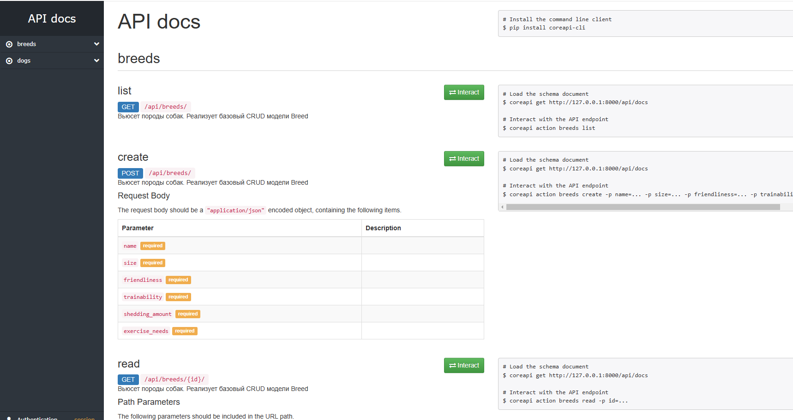
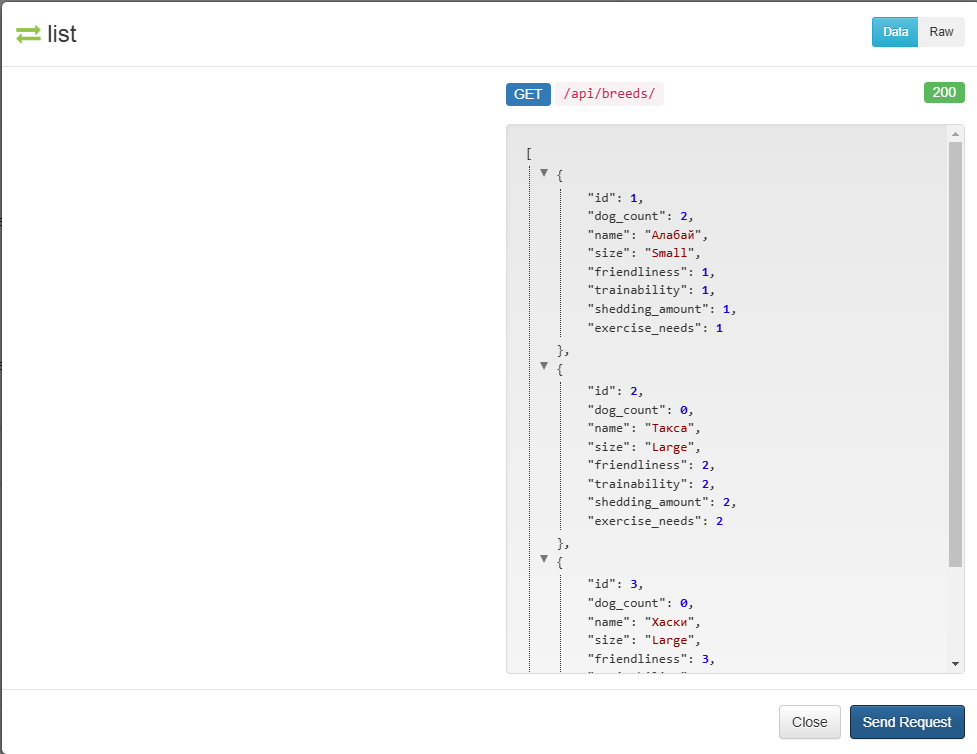
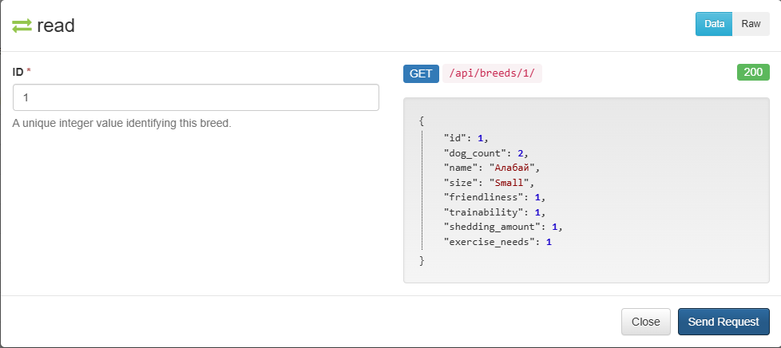
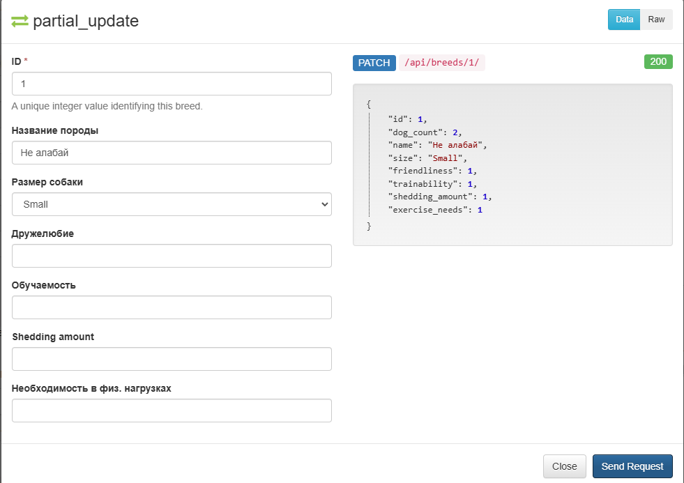

# TestovoeEffective
API Разработка системы управления собачьим приютом


<!--Установка-->
## Установка 
У вас должны быть установлены [зависимости проекта](https://github.com/Mike0001-droid/DjangoPractic/blob/main/requirements.txt)

1. Клонирование репозитория 

```git clone https://github.com/Mike0001-droid/DjangoPractic.git```

2. Переход в директорию DogsAndBreeds

```cd DogsAndBreeds```

3. Создание виртуального окружения

```python -m venv venv```

4. Активация виртуального окружения

```cd venv/scripts/activate```

5. Установка зависимостей

```pip install -r requirements.txt```

6. Запуск миграций

```python manage.py migrate```

7. Создание админа

```python manage.py createsuperuser```

8. Запуск сервера

```python manage.py runserver```

## Компоненты сервиса

1. Модель - таблица в базе данных

2. Сериализатор - инструмент, который преобразует данные в промежуточный формат, в нашем случае - JSON

3. Views. В классическом Django используется архитектура MVT (Model View Template), в нашем случае мы используем 
DRF, значит, применяем архитектуру REST, а вместо классических views используем ViewSet с заготовленным набором
методов для реализации функционала сервиса

4. API документация для удобной отладки. Я решил использовать интерактивную документацию API DRF, чтобы 
иметь возможность комфортно тестировать реализованные HTTP запросы

## Возможности сервиса

1. CRUD операции с таблицей Dog 

2. CRUD операции с таблицей Breed

## Примеры использования API 

1. Интерфейс API документации


2. Список всех пород


3. Порода по айдишнику


4. Частичное обновление породы

